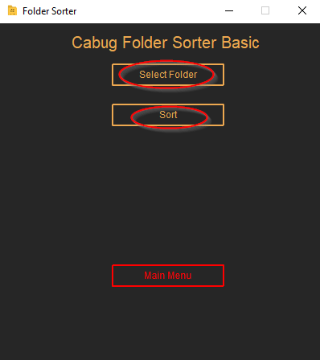

# The folder sorter v3.0.0

[](https://github.com/AIIrondev/Cabug-Folder-sorter/actions/workflows/main.yml)

This Projekt is developt by AiIrondev(Maximilian Gründinger) in Python.
This folder sorter is in active development and has more Versions to come -> v4.0.0.

## Table of Contents

- [Installation](#installation)
- [Functions](#functions)
- [Guide](#guide)
- [Further](#further)

## Installation

To use the Cabug folder sorter, you need to install the Software. Follow the instructions below to get started:

1. Download the latest version of the Cabug folder sorter from the [github repository](https://github.com/AIIrondev/Folder-sorter/releases).
2. Verify the installation by running the programm.
3. If there is any Problem please send a Email to <Iron.ai.dev@gmail.com> for bug fixing.

## Functions

- Simple Mode -> In this mode, the Programm will sort the files in the folder you selectet.
- Advanced Checkbox Mode -> In this Mode, you can select multible category's that you want to sort.
- Advanced Scripting Mode -> In this Mode, you can select an .json file in that you can write the Label and the file endings that you want to sort.

## Guide

This is a simple guide for you to undestand the programm and to use the Programm the best way.

### 1. Main Menu

In the main menu, you can choose one of the two sorting options. Additionally, you can click on the cogwheel.


### 2. Option Menu

In the options menu, you can click on the 'About' or 'Help' button. You can also select the language of your choice. To go back, simply press the 'Main Menu' button.


### 3. Advanced Menu

Here, you can select the advanced option that you want to choose, either the Advanced Script Menu or the Advanced Checkbox Menu.


### 4. Simple Mode

In this mode, you can simply select the folder that you want to sort by clicking on the 'Select Folder' button. Once you have selected the correct folder, you can click on the 'Sort' button.



### 5. Advanced Scripting Mode

This is the mode where you can select a .json file that may look like this:

```json
{"Images": [".png", ".jpg", ".jpeg", ".gif", ".bmp", ".tiff", ".webp", ".svg", ".ico"], "Videos": [".mp4", ".mkv", ".webm", ".flv", ".avi", ".mov", ".wmv", ".mpg", ".mpeg", ".3gp", ".3g2"]}
```

You have to select the file using the 'Select File' button, and then choose the folder you want to sort with the selected file.


### 6. Advanced Checkbox Mode

Here, you can select the categories that you want to sort. After selecting the folder you want to sort, simply press the 'Sort' button.


If you have an Questions you can Write an Email to <Iron.ai.dev@gmail.com>.

## Further

I startet the Projekt in 2019, because I liked standardised stuff so this is the way for my Dokuments and every Folfer on my PC.
